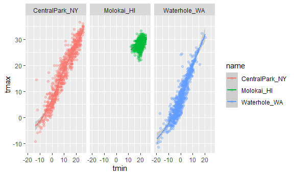
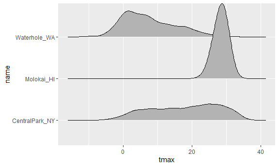

GGPlot_Markdown
================

\*Basic Graph Components\*\*

- Data: our actual information

- Aesthetic mappings: Need to map the aesthetics of the plot to the
  variables –\> need to know what we actually want

- geoms: A layer combines data, aesthetic mapping, a geom (geometric
  object)

## Viz and EDA

``` r
library(tidyverse)
```

    ## ── Attaching core tidyverse packages ──────────────────────── tidyverse 2.0.0 ──
    ## ✔ dplyr     1.1.2     ✔ readr     2.1.4
    ## ✔ forcats   1.0.0     ✔ stringr   1.5.0
    ## ✔ ggplot2   3.4.2     ✔ tibble    3.2.1
    ## ✔ lubridate 1.9.2     ✔ tidyr     1.3.0
    ## ✔ purrr     1.0.1     
    ## ── Conflicts ────────────────────────────────────────── tidyverse_conflicts() ──
    ## ✖ dplyr::filter() masks stats::filter()
    ## ✖ dplyr::lag()    masks stats::lag()
    ## ℹ Use the conflicted package (<http://conflicted.r-lib.org/>) to force all conflicts to become errors

``` r
library(ggridges)

knitr::opts_chunk$set(
  fig.width= 6,
  fig.asp= .6,
  out.width= "90%"
)
```

Pulling in data from a national weather registry. Keeping certain
variables and recoding the name to be more descriptive in our case.

``` r
weather_df = 
  rnoaa::meteo_pull_monitors(
    c("USW00094728", "USW00022534", "USS0023B17S"),
    var = c("PRCP", "TMIN", "TMAX"), 
    date_min = "2021-01-01",
    date_max = "2022-12-31") |>
  mutate(
    name = recode(
      id, 
      USW00094728 = "CentralPark_NY", 
      USW00022534 = "Molokai_HI",
      USS0023B17S = "Waterhole_WA"),
    tmin = tmin / 10,
    tmax = tmax / 10) |>
  select(name, id, everything())
```

    ## using cached file: C:\Users\andyj\AppData\Local/R/cache/R/rnoaa/noaa_ghcnd/USW00094728.dly

    ## date created (size, mb): 2023-09-28 10:20:25.291866 (8.541)

    ## file min/max dates: 1869-01-01 / 2023-09-30

    ## using cached file: C:\Users\andyj\AppData\Local/R/cache/R/rnoaa/noaa_ghcnd/USW00022534.dly

    ## date created (size, mb): 2023-09-28 10:20:39.776995 (3.838)

    ## file min/max dates: 1949-10-01 / 2023-09-30

    ## using cached file: C:\Users\andyj\AppData\Local/R/cache/R/rnoaa/noaa_ghcnd/USS0023B17S.dly

    ## date created (size, mb): 2023-09-28 10:20:44.462496 (0.996)

    ## file min/max dates: 1999-09-01 / 2023-09-30

Let’s make a plot!

``` r
ggplot(weather_df, aes(x = tmin, y = tmax)) +
  geom_point()
```

    ## Warning: Removed 17 rows containing missing values (`geom_point()`).


Helpway coding options

- geom_point: gives us a scatterplot

- 

**Pipes and Stuff**

``` r
weather_df |> 
  filter(name == "CentralPark_NY") |> 
  ggplot(aes(x=tmin, y=tmax)) +
  geom_point()
```


``` r
ggp_nyc_weather= 
  weather_df |> 
  filter(name == "CentralPark_NY") |> 
  ggplot(aes(x=tmin, y=tmax)) +
  geom_point()
```

This version takes the same plot. Can help us since we are basically
saying “start with this data frame” and then we can add additional
options below it not just limited to making our graphs!

## Fancy Plot

``` r
ggplot(weather_df, aes(x=tmin, y=tmax, color=name))+
  geom_point()+
  geom_smooth()
```

    ## `geom_smooth()` using method = 'loess' and formula = 'y ~ x'

    ## Warning: Removed 17 rows containing non-finite values (`stat_smooth()`).

    ## Warning: Removed 17 rows containing missing values (`geom_point()`).


``` r
ggplot(weather_df, aes(x=tmin, y=tmax))+
  geom_point(aes(color=name))+
  geom_smooth()
```

    ## `geom_smooth()` using method = 'gam' and formula = 'y ~ s(x, bs = "cs")'

    ## Warning: Removed 17 rows containing non-finite values (`stat_smooth()`).
    ## Removed 17 rows containing missing values (`geom_point()`).


``` r
ggplot(weather_df, aes(x=tmin, y=tmax))+
  geom_point(aes(color=name))+
  geom_smooth(se= FALSE)
```

    ## `geom_smooth()` using method = 'gam' and formula = 'y ~ s(x, bs = "cs")'

    ## Warning: Removed 17 rows containing non-finite values (`stat_smooth()`).
    ## Removed 17 rows containing missing values (`geom_point()`).


``` r
ggplot(weather_df, aes(x=tmin, y=tmax))+
  geom_point(aes(color=name), alpha= 0.3)+
  geom_smooth(se= FALSE)
```

    ## `geom_smooth()` using method = 'gam' and formula = 'y ~ s(x, bs = "cs")'

    ## Warning: Removed 17 rows containing non-finite values (`stat_smooth()`).
    ## Removed 17 rows containing missing values (`geom_point()`).


- All we did was adding up colors based off of the name (the location
  for the data!)

- In first for fancy, we colored all the points and the geom_smooth
  line. For the second, we are just coloring the points and the smooth
  will not change colors.

- Third graph adds in a se= FALSE which takes away SE bars?

- 4th: we are adding alpha under geom_point to make certain values more
  transparent.

**Plot with facets**

``` r
ggplot(weather_df, aes(x=tmin, y=tmax, color=name))+
  geom_point(alpha=0.3) +
  geom_smooth() +
  facet_grid(. ~ name)
```

    ## `geom_smooth()` using method = 'loess' and formula = 'y ~ x'

    ## Warning: Removed 17 rows containing non-finite values (`stat_smooth()`).

    ## Warning: Removed 17 rows containing missing values (`geom_point()`).



- We are using facet to separate everything by their name. We use (. ~
  variable) to separate our plots verticals into different of the
  variable.

Let’s try a different plot. no longer temp.

``` r
ggplot(weather_df, aes(x=date, y=tmax, color= name))+
  geom_point()
```

    ## Warning: Removed 17 rows containing missing values (`geom_point()`).


``` r
ggplot(weather_df, aes(x=date, y=tmax, color= name))+
  geom_point(aes(size=prcp), alpha=0.3)+
  geom_smooth() + 
  facet_grid(. ~ name)
```

    ## `geom_smooth()` using method = 'loess' and formula = 'y ~ x'

    ## Warning: Removed 17 rows containing non-finite values (`stat_smooth()`).

    ## Warning: Removed 19 rows containing missing values (`geom_point()`).


- Now we can see the temperature variation.

- 2nd: we add in the smoothing lines, make the points more transparent,
  and we are also adding precipitation data to our individual points. We
  are adding precip data in expanding points based on precip.

**Trying to assign a specific color**

``` r
weather_df |> 
  filter(name =="CentralPark_NY") |> 
  ggplot(aes(x=date, y= tmax))+
  geom_point(color= "blue")
```


``` r
weather_df |> 
  filter(name== "Molokai_HI") |> 
  ggplot(aes(x=date, y=tmax)) +
  geom_line(alpha= 0.5)+
  geom_point(size= 0.5)
```

    ## Warning: Removed 1 rows containing missing values (`geom_point()`).


`geom_line` helps us make a line graph

geo_hex() does something??

\#univariate plotting histogram

``` r
ggplot(weather_df, aes(x=tmax))+
  geom_histogram()
```

    ## `stat_bin()` using `bins = 30`. Pick better value with `binwidth`.

    ## Warning: Removed 17 rows containing non-finite values (`stat_bin()`).


``` r
ggplot(weather_df, aes(x=tmax, fill=name))+
  geom_density(alpha= .3)
```

    ## Warning: Removed 17 rows containing non-finite values (`stat_density()`).


**Boxplots**

``` r
ggplot(weather_df, aes(y=tmax))+
  geom_boxplot()
```

    ## Warning: Removed 17 rows containing non-finite values (`stat_boxplot()`).


``` r
ggplot(weather_df, aes(y=tmax, x = name))+
  geom_boxplot()
```

    ## Warning: Removed 17 rows containing non-finite values (`stat_boxplot()`).


- Using Y= sets the boxplots vertically

**Violin Plots**

``` r
ggplot(weather_df, aes(y=tmax, x=name))+
  geom_violin()
```

    ## Warning: Removed 17 rows containing non-finite values (`stat_ydensity()`).


**Ridge Plot**

``` r
ggplot(weather_df, aes(x=tmax, y= name))+
  geom_density_ridges()
```

    ## Picking joint bandwidth of 1.54

    ## Warning: Removed 17 rows containing non-finite values
    ## (`stat_density_ridges()`).



## Saving and embedding plots

``` r
ggp_weather=
  weather_df |> 
  ggplot(aes(x=tmin, y=tmax))+
  geom_point()

ggp_weather
```

    ## Warning: Removed 17 rows containing missing values (`geom_point()`).


``` r
ggsave("results/ggp_weather.pdf", ggp_weather)
```

    ## Saving 6 x 3.59 in image

    ## Warning: Removed 17 rows containing missing values (`geom_point()`).

- we made new folder for the plot

``` r
ggp_weather
```

    ## Warning: Removed 17 rows containing missing values (`geom_point()`).


``` r
ggp_weather
```

    ## Warning: Removed 17 rows containing missing values (`geom_point()`).


